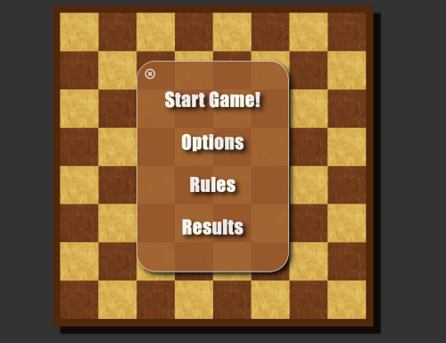
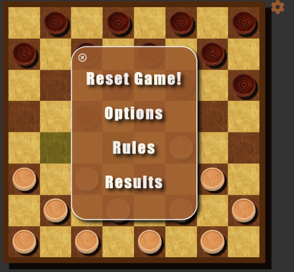
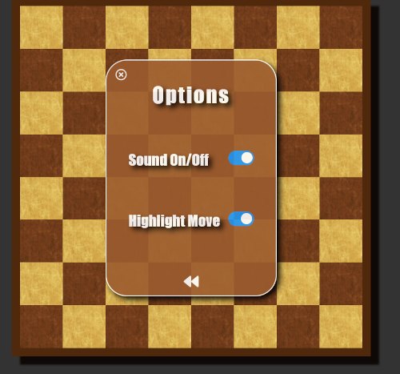
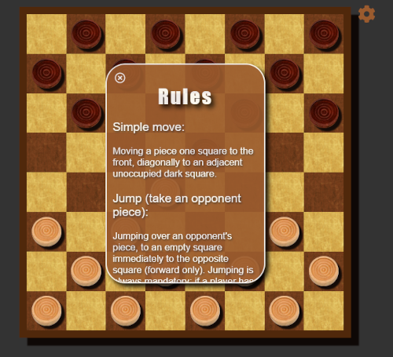
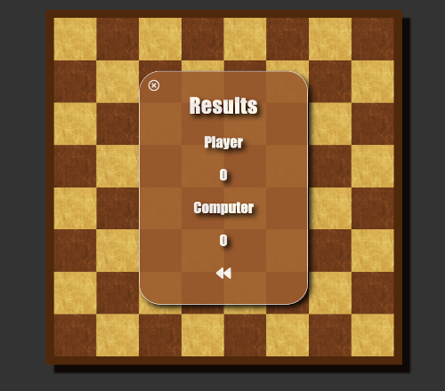

# Checker's Game

## Introduction

The Checker's Game is a game that consists of a board with 64 squares, 32 of which are occupied by 16 black and 16 white pieces. The pieces are placed in the 12 squares closest to each player. The objective of the game is to capture all the opponent's pieces or to block them so that they cannot move. There are many variations of the game. The rules implemented in this project are based on the international rules but using a 8x8 board.
The game code was developed in javascript and the interface was developed in HTML and CSS.

<a href="https://cafalchio.github.io/checkers_game/" rel="nofolow">Visit and play the live version of the game here</a>

The game can be played on any device, including small mobile phones as smaller as (250 x 300 px).

## Table of Contents

- [Checker's Game](#checkers-game)
  - [Introduction](#introduction)
  - [Table of Contents](#table-of-contents)
  - [UX](#ux)
      - [Strategy](#strategy)
  - [Technologies](#technologies)
  - [Features](#features)
    - [Main Page](#main-page)
    - [Options Menu](#options-menu)
    - [Rules Menu](#rules-menu)
    - [Results Menu](#results-menu)
    - [Game](#game)
  - [Testing](#testing)
  - [Unfixed Bugs](#unfixed-bugs)
  - [Features Left to Implement](#features-left-to-implement)
  - [Deployment](#deployment)
  - [Credits](#credits)
  - [Acknowledgements](#acknowledgements)

## UX

#### Strategy

- Site goals

  - The main goal of the site is to provide a fun and interactive game for the user to play.
  - To have a pleasant wood theme that is easy to use and navigate.
  - To have a responsive design that is easy to use on any device.
  - With a intuituve menu that is easy to use and navigate.

- User goals
  - The user goals are to have a fun and interactive game to play.
  - The user can play the game on any device.

## Technologies

The technologies used in this project were HTML, CSS and JavaScript. The HTML was used to create the structure of the page, the CSS was used to style the page and the JavaScript was used to make the entire game work.

    * HTML
    * CSS
    * JavaScript
    * GitHub
    * GIMP

## Features

### Main Page

The main page is the first page that the user sees when they visit the site. It has four buttons, one to start the game, one to see the rules, one to see the options and one to see the results. Once the player has started the game, the the Start Game button will be replaced by a button to restart the game.

### Options Menu

The options menu allows the user to change the game settings. The user can change the sound On/Off and the higlight On/Off. The highlight is the highlight of the possible moves of the selected piece. The sound is the sound of the pieces moving and the sound of the pieces being captured.

### Rules Menu

### Results Menu

### Game

- Landing page
  The landing page is the first page that the user sees when he enters the game. It has a title, a button to start the game and a button to see the rules of the game.

<!-- add image of each feature -->

- Interactive game
  The game is played in the browser. The user can choose the color of the pieces and the level of the computer. The user can also choose to play against another player.

- Score board
  The score board is a table that shows the number of pieces that each player has captured.

- Rules
  The rules page shows the rules of the game.

## Testing

The website was tested on a desktop computer and a mobile phone.
Also, W3C and Jigsaw validation was used to validate the website HTML and CSS.

W3C Validation:

<!-- 

Jigsaw Validation:

Lighhouse mobile and desktop testing:

 -->

The major concerns were the speed to load the images. The images were reduced both in size and optimizila image compressor. The speed increased but it is still a concern in slow phone connection.
So images were converted to jpg format and the quality was reduced.

## Unfixed Bugs

- dragging
  Sometimes the user can drag the background, which is not the desired behavior.

## Features Left to Implement

- The game could be played in two players mode.
- A timer could be added to the game.

## Deployment

- The game was deployed on GitHub pages.

## Credits

- Stack Overflow

## Acknowledgements

- My mentor for saving me from starting in a wrong way, which would make the project impossible to finish.
- My colleagues for the slack channel.
- The student tutors for the help.
